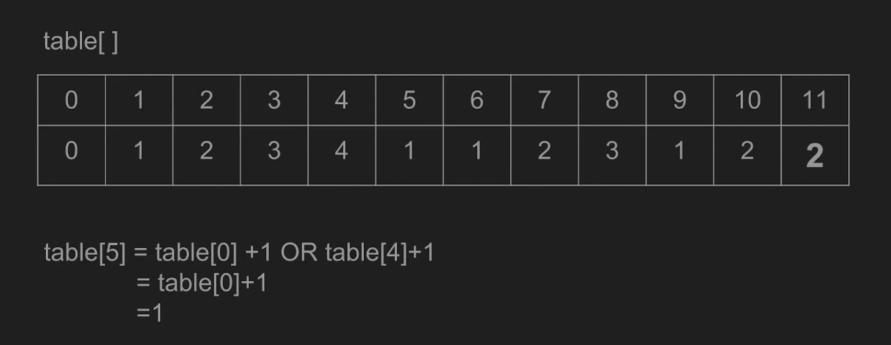

## 当天计划

> 当天计划模板

5:30 ～ 6:00 leetcode   
6:05 ~ 7:00 leetcode  
7:05 ~ 7;30 dinner  
8:00 ~ 8:30 虚拟环境env_RL，装DeepX 环境，看论文，打印回家看  
10:00 ～ 11:00 锻炼，囚徒健身  
11:00 ～ 12:00 日语电视剧解读   

### 322. Coin Change

 >          sub_res = table[i - coins[j]]   
 >               if (sub_res != sys.maxsize and   
 >                   sub_res + 1 < table[i]):   
 >                   table[i] = sub_res + 1  
 4减去1就是3， 这是当有了面值为1的coin时的余数。 接下来的判断，我们判断这个余数的table值  
 *  1. 是不是非初始值（无穷大）
 *  2. 是不是 + 1 之后仍小于当前table值
    *  如果大于当前table值的话，那么说明有别的面值的coin已经提供了更好的组合。

接下来是非常关键的table元素更新：  
table元素的更新就是dynamic programming的特征之一的Optimal Substructure。  
>                   table[i] = sub_res + 1 
 因为sub_res是其中一种coin面值的余数，余数的table值indicate的是上一层的策略结果（对应dp概念）。  

Time complexity : O(S*n).   
 > where S is the amount, n is denomination count.   
 
Space complexity : O(S)O(S).

两个动态编程的特征：
 * 1. Overlapping Subproblems
   * 重叠的子问题
 * 2. Optimal Substructure
   * 最优解的子问题也是最优解

#### Coin Change 结语
* 还是没有办法把对问题解法的理解和dp模板的理解进行融合，希望看到以后的例题能有新的启发。  
* 发现dynamic programming都涉及到table，需要用table来储存已经计算过得结果。通过索引来访问上一层的结果。

